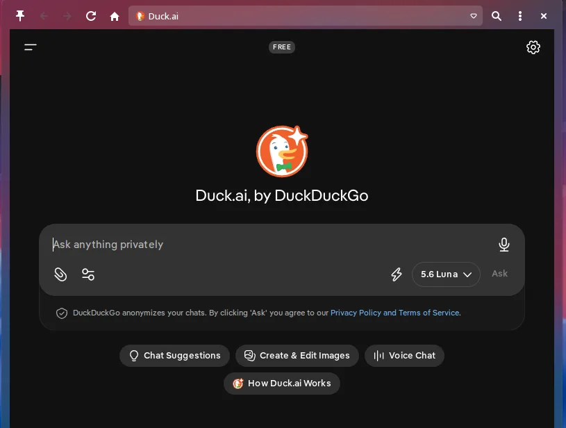
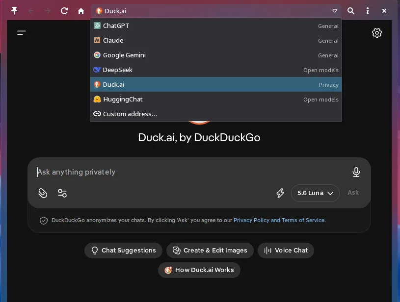
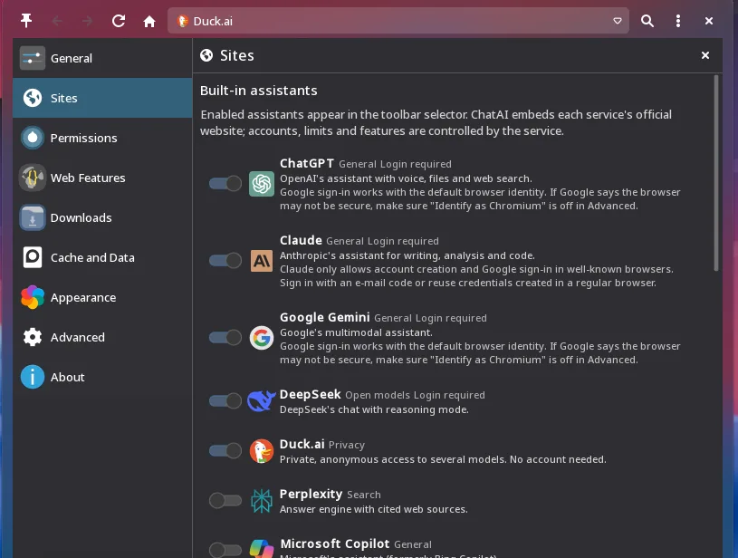
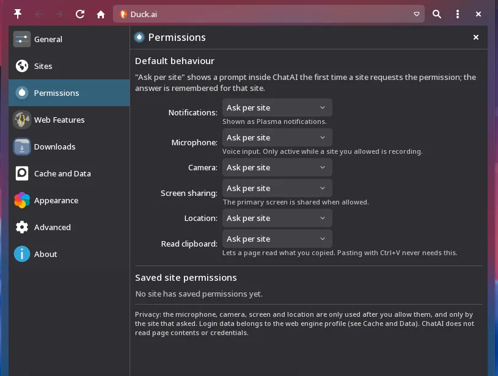

<p align="center">
  
</p>

<h1 align="center">ChatAI</h1>

<p align="center">
  <b>Your AI assistants, right inside KDE Plasma.</b><br>
  A native Plasma 6 widget that puts ChatGPT, Claude, Gemini, DeepSeek and many
  other web assistants one click away — no extra browser tabs, no separate apps.
</p>

<p align="center">
  
  
  
  
  
  
  <br>
  <a href="https://github.com/ruscher/ChatAI-Plasmoid/stargazers"></a>
  <a href="https://github.com/ruscher/ChatAI-Plasmoid/issues"></a>
  <a href="https://github.com/ruscher/ChatAI-Plasmoid/commits/main"></a>
</p>

<p align="center">
  
</p>

---

## Table of Contents

- [About](#about)
- [Screenshots](#screenshots)
- [What's New in 1.0.1](#whats-new-in-101)
- [Features](#features)
- [Providers](#providers)
- [Requirements](#requirements)
- [Install](#install)
- [Update](#update)
- [Remove](#remove)
- [Using ChatAI](#using-chatai)
- [Settings](#settings)
- [Privacy and Security](#privacy-and-security)
- [Performance](#performance)
- [Compatibility](#compatibility)
- [Troubleshooting](#troubleshooting)
- [Development](#development)
- [Contributing](#contributing)
- [Authors & Maintainers](#authors--maintainers)
- [Contributors](#contributors)
- [License and Assets](#license-and-assets)

---

## About

**ChatAI** is a widget (plasmoid) for the **KDE Plasma 6** desktop. It embeds the
official web interfaces of AI assistants inside a compact, native popup so you can
switch between them from a single place — the panel or the desktop — instead of
juggling browser tabs or standalone apps.

Under the hood it uses **Qt WebEngine** (Chromium) with a persistent profile, so
each service keeps its own login, cookies and local storage exactly as it would in
a normal browser. Closing the widget releases the web engine to free memory.

**What ChatAI is:**

- a convenient front-end to the assistants' own websites;
- a native Plasma integration with a toolbar, provider switcher, per-site
  permissions, downloads and configuration.

**What ChatAI is not:**

- it is **not** an AI API or model, and does not replace the providers;
- it does **not** bypass authentication, CAPTCHAs or anti-bot protections;
- it does **not** proxy, store or inspect your conversations.

If a service works in a regular Chromium browser, it generally works here too,
subject to that service's own rules for embedded browsers.

---

## Screenshots

<table>
  <tr>
    <td align="center" width="50%">
      <br>
      <sub><b>Switch between assistants</b></sub>
    </td>
    <td align="center" width="50%">
      <br>
      <sub><b>Configuration inside the widget</b></sub>
    </td>
  </tr>
  <tr>
    <td align="center" width="50%">
      <br>
      <sub><b>Per-site permissions</b></sub>
    </td>
    <td align="center" width="50%">
      <br>
      <sub><b>Native Plasma popup</b></sub>
    </td>
  </tr>
</table>

---

## What's New in 1.0.1

This release is a substantial overhaul focused on usability, sign-in reliability
and resource use.

### Redesigned toolbar and provider switcher

A cleaner toolbar — Pin · Back · Forward · Reload/Stop · Home · **assistant
selector** · Find · ⋮ menu · Close — with an icon-and-name selector and a kebab
(⋮) menu that gathers zoom, full screen, downloads, settings and more. Secondary
controls fold into the menu automatically when the popup is narrow.

### Reliable sign-in, including "Continue with Google"

Redirect-based logins run in the main view; `window.open()`-based logins (used by
several providers for Google/Apple/Microsoft) now open in an **in-widget sign-in
window that shares the same profile**, so `window.opener`, `postMessage()` and
`window.close()` behave correctly and the callback completes. The widget keeps
Qt WebEngine's honest identity, which Google's sign-in accepts.

### More AI providers

Added **GitHub Copilot**, **Manus**, **Qwen**, **Kimi** and **Mistral Vibe**, with
optimized icons.

### Granular privacy controls

Per-site permissions for notifications, microphone, camera, screen sharing,
location and clipboard, each set to **Ask / Allow / Block**. "Ask" shows an inline
prompt and the choice is remembered per origin, reviewable and resettable.

### Modern downloads

A temporary toolbar indicator with a real progress ring appears only while a
download needs attention. A popup lists downloads with pause, resume, cancel,
open, **show in folder** and retry, plus a KDE notification with actions.

### Better memory and lifecycle management

The web engine is created lazily, frozen when the page is hidden (when safe) and
fully released on Close.

### Zoom, full screen and more

Page zoom (50–200 %) with shortcuts, real full screen (also honouring page
requests), PDF/MHTML export, find in page, and optional developer tools and
diagnostics.

---

## Features

### 🤖 Multiple AI providers
Switch between 20 built-in assistants from one widget, or add your own sites.

### 🧭 Integrated navigation
Back, Forward, Reload/Stop, Home, Find in page, zoom and full screen.

### 🔐 Per-site permissions
Ask / Allow / Block per permission type, remembered per origin and resettable.

### 📥 Modern downloads
Progress ring indicator, list with pause/resume/cancel, open, show in folder and retry.

### ⚡ Resource-conscious
Lazy Qt WebEngine start, page freezing when hidden, full release on Close.

### 🎨 Plasma integration
Kirigami/Breeze styling, theme-aware icons, panel or desktop, HiDPI-friendly.

### 🔧 Advanced controls
Custom sites, WebEngine profiles, cache management, user-agent options,
developer tools and a sanitized diagnostics view.

---

## Providers

Providers come from a single registry (`contents/ui/ProviderModel.qml`). Enable or
disable any of them in **Settings → Sites**.

| Provider | Default | Login | Notes |
| --- | :---: | :---: | --- |
| ChatGPT | ✅ | Account | |
| Claude | ✅ | Account | Google sign-in restricted by the service |
| Google Gemini | ✅ | Account | |
| DeepSeek | ✅ | Account | |
| Duck.ai (DuckDuckGo) | ✅ | No account | Anonymous access to several models |
| HuggingChat | ✅ | Optional | Open models |
| Perplexity | ➖ | Optional | Answer engine with cited sources |
| Microsoft Copilot | ➖ | Optional | |
| GitHub Copilot | ➖ | GitHub | Coding assistant on github.com |
| Mistral Vibe | ➖ | Account | Formerly "Le Chat" |
| Grok | ➖ | Optional | xAI |
| Qwen | ➖ | Optional | Alibaba |
| Kimi | ➖ | Optional | Moonshot AI |
| Manus | ➖ | Account | General agent with a chat mode |
| Meta AI | ➖ | Account | Availability depends on your region |
| T3 Chat | ➖ | Account | Multi-model client |
| You.com | ➖ | Account | |
| BlackBox AI | ➖ | Account | Coding assistant |
| LobeChat | ➖ | Account | |
| Big-AGI | ➖ | Optional | Bring your own keys |

> Availability, login methods and features are decided entirely by each service.
> Websites can change without notice, and some providers restrict sign-in inside
> embedded browsers.

### Custom sites

Add any chat website in **Settings → Sites → Custom sites**: give it a name and an
`http(s)` address. Custom sites can be edited and removed, use the ChatAI logo as
icon, and get no special access to your system. You can also type a one-off address
with the **Custom address…** entry in the toolbar selector.

---

## Requirements

| Component | Requirement |
| --- | --- |
| KDE Plasma | 6 (`X-Plasma-API-Minimum-Version` 6.0) |
| KDE Frameworks | 6 |
| Qt | 6 |
| Qt WebEngine | Required (`qt6-webengine`) |
| Wayland | Supported |
| X11 / Xorg | Supported |

**Tested with:** Plasma 6.7, KDE Frameworks 6, Qt / Qt WebEngine 6.11 on Wayland.

Qt WebEngine is the only non-standard runtime dependency; on most distributions it
is packaged separately (for example `qt6-webengine`).

---

## Install

```bash
git clone https://github.com/ruscher/ChatAI-Plasmoid.git
cd ChatAI-Plasmoid
zip -qr ChatAI-Plasmoid.plasmoid metadata.json contents LICENSE
kpackagetool6 --type Plasma/Applet --install ChatAI-Plasmoid.plasmoid

# Register the app logo (shown on the About page and in the widget list)
install -Dm644 ~/.local/share/plasma/plasmoids/ChatAI-Plasmoid/contents/ui/assets/logo.svg \
    ~/.local/share/icons/hicolor/scalable/apps/chatai.svg
```

Then add the widget to your desktop or panel:

1. Right-click the desktop or panel → **Enter Edit Mode**.
2. Click **Add Widgets…**.
3. Search for **ChatAI**.
4. Drag it onto the panel or desktop.

You can also install a downloaded `.plasmoid` file with the same
`kpackagetool6 --install` command.

---

## Update

```bash
git pull
zip -qr ChatAI-Plasmoid.plasmoid metadata.json contents LICENSE
kpackagetool6 --type Plasma/Applet --upgrade ChatAI-Plasmoid.plasmoid

# Refresh the app logo
install -Dm644 ~/.local/share/plasma/plasmoids/ChatAI-Plasmoid/contents/ui/assets/logo.svg \
    ~/.local/share/icons/hicolor/scalable/apps/chatai.svg
```

Your settings are preserved across updates. On first launch the widget migrates
older configuration automatically, keeping your enabled providers, custom sites,
permissions and WebEngine sessions. If the widget was already running, log out and
back in (or restart Plasma) so the new version is loaded.

---

## Remove

**Remove the widget:**

```bash
kpackagetool6 --type Plasma/Applet --remove ChatAI-Plasmoid
rm -f ~/.local/share/icons/hicolor/scalable/apps/chatai.svg
```

**Remove the browsing data (optional).** Cookies, logins, storage, cache and
per-site permissions live in the WebEngine profile folders below. Deleting them
signs you out of every service:

```bash
rm -rf ~/.local/share/plasmashell/QtWebEngine/chat-ai
rm -rf ~/.cache/plasmashell/QtWebEngine/chat-ai
```

Replace `chat-ai` with your profile's storage name if you changed it in
**Settings → Cache and Data**.

---

## Using ChatAI

| Action | How |
| --- | --- |
| Switch assistant | Selector in the toolbar (Tab to it, arrow keys, Enter) |
| Add / type a custom site | **Custom address…** in the selector, or Settings → Sites |
| Go back / forward | Toolbar buttons, or the mouse Back/Forward buttons |
| Reload / stop | Reload button (turns into Stop while loading) |
| Home | Home button — the current assistant's start page |
| Find in page | `Ctrl+F` |
| Zoom in / out / reset | `Ctrl++` / `Ctrl+-` / `Ctrl+0`, or ⋮ → Zoom |
| Full screen | `F11` (or ⋮ → Full Screen); `Esc` exits |
| Keep the popup open | Pin button |
| Downloads | The ↓ indicator when shown, or ⋮ → Downloads |
| Open the current page in a browser | ⋮ → Open in Browser |
| Release web engine memory | Close button |

---

## Settings

Settings are available both in the Plasma configuration dialog and inside the
widget (⋮ → ChatAI Settings), sharing the same options.

| Page | What you configure |
| --- | --- |
| **General** | Home assistant, pin, preload at login, toolbar behaviour |
| **Sites** | Enable built-in assistants; add, edit and remove custom sites |
| **Permissions** | Ask/Allow/Block per type; review and reset per-site decisions |
| **Web Features** | Clipboard, new windows, autoplay, spatial navigation, focus, unknown schemes |
| **Downloads** | Download folder and the current download list |
| **Cache and Data** | Cache location and limit, clear cache, WebEngine profile (storage name) |
| **Appearance** | Panel icon style and which toolbar buttons are shown |
| **Advanced** | Browser identity / user agent, page freezing, discard timer, developer tools, diagnostics |
| **About** | Version, links, authors and keyboard shortcuts |

---

## Privacy and Security

ChatAI separates **what the widget does locally** from **what the AI services do
with your data**.

### Local privacy (handled by ChatAI)

- **Profile & sessions** — cookies, logins, local storage and per-site permissions
  are stored by Qt WebEngine under
  `~/.local/share/plasmashell/QtWebEngine/<storage name>` (cache under
  `~/.cache/...`). Each storage name is a separate, isolated profile.
- **Permissions** — microphone, camera, screen sharing, location, notifications and
  clipboard are used only after you allow them, and only for the site that asked.
  Unknown permission types are denied.
- **Links & schemes** — only `http(s)` navigates or opens externally; unknown URL
  schemes are blocked unless you enable them, and then only after a click. Invalid
  TLS certificates are rejected.
- **Downloads** — file names are sanitized and files are never executed
  automatically.
- ChatAI does **not** log or transmit your cookies, credentials, page contents or
  clipboard. Clearing the cache does not sign you out.

### AI provider privacy (handled by each service)

Anything you type or upload to ChatGPT, Claude, Gemini, DeepSeek or any other
provider is sent to **that service** and is governed by **its** terms and privacy
policy. ChatAI is only the window to their websites — it has no control over how
they process, store or use your data. Review each provider's policy for details.

---

## Performance

- **Lazy start** — Qt WebEngine is created only when the widget is first opened
  (or preloaded at login if you enable it).
- **Freeze when hidden** — a hidden page is frozen after a short delay when the
  engine reports it is safe (no audio, upload or download in progress); it resumes
  instantly when shown. An optional timer can discard very old hidden pages.
- **Release on close** — the Close button destroys the web view and its renderer
  process, returning memory to the system. Logins remain on disk.
- **Cache control** — set an HTTP cache size limit and clear the cache on demand.

---

## Compatibility

- **KDE Plasma 6** on both **Wayland** and **X11/Xorg**.
- **HiDPI** — vector icons and Plasma units scale with the display.
- **Qt WebEngine** — the widget uses the version provided by your system.
- **Embedded-login limits** — a few services restrict sign-in inside embedded
  browsers (Google's OAuth is the most common). Where a provider blocks embedded
  sign-in by policy, use e-mail sign-in or a session created in a regular browser.

---

## Troubleshooting

| Problem | Solution |
| --- | --- |
| A provider does not load | Use ⋮ → Reload, or **Open in Browser**; the site may reject embedded sessions |
| ChatGPT seems stuck at first | Give it a moment; if a "slow to respond" notice appears, use **Retry**. Keep the popup reasonably wide (its mobile layout can misbehave) |
| Google sign-in says "browser may not be secure" | Make sure **Advanced → Identify as Chromium** is **off** — Google accepts the honest Qt WebEngine identity and rejects disguised ones |
| A sign-in popup does not finish | Complete it in the in-widget sign-in window; press `Esc` or its close button to cancel and try again |
| Notifications do not appear | Set Permissions → Notifications to Ask/Allow and check Plasma's notification settings |
| Downloads fail | Choose an existing, writable folder in Settings → Downloads |
| A provider stopped working | The service may have changed its site; report it in the issues tracker |
| Something looks wrong after an update | Advanced → Diagnostics → **Copy**, then include the sanitized info in an issue |

Still stuck? Open an issue: <https://github.com/ruscher/ChatAI-Plasmoid/issues>

---

## Development

The project is pure QML/JavaScript on top of Qt Quick, Qt WebEngine and Kirigami —
no compiled code.

```text
ChatAI-Plasmoid/
├── .github/workflows/     # CI: validation, translation, contributors list
├── contents/
│   ├── config/            # KConfig schema (main.xml) and config categories
│   ├── locale/            # Compiled translations shipped with the package
│   └── ui/                # QML: widget, WebView, provider registry, settings
│       ├── settings/      # Shared settings pages (dialog + in-widget panel)
│       └── assets/        # Provider and logo SVG icons
├── locale/                # Translation sources (.pot / .po / .json)
├── metadata.json          # Plasma package metadata
├── LICENSE
└── README.md
```

Key pieces: `main.qml` orchestrates the plasmoid; `WebView.qml` hosts Qt WebEngine
(profile, navigation, permissions, downloads, zoom, full screen, lifecycle);
`ProviderModel.qml` is the single source of truth for providers; `Header.qml`,
`AiSelector.qml` and `ChatAIMenu.qml` build the toolbar; the `settings/` pages are
shared between the Plasma configuration dialog and the in-widget panel.

### Commands

```bash
# Build the runtime package
zip -qr ChatAI-Plasmoid.plasmoid metadata.json contents LICENSE

# Static checks (same as CI)
python3 -m json.tool metadata.json > /dev/null
xmllint --noout contents/config/main.xml
qmllint contents/ui/*.qml contents/ui/settings/*.qml contents/config/*.qml
for po in locale/*.po; do msgfmt --check --check-format -o /dev/null "$po"; done

# Run the widget in a standalone window
plasmawindowed ChatAI-Plasmoid
```

Compiled translations (`contents/locale/**/*.mo`) ship in the package; regenerate
them from `locale/*.po` with `msgfmt` (and `xgettext` / `msgmerge` from GNU
gettext) when strings change.

Continuous integration (`.github/workflows/`) runs these checks on every push and
keeps the contributors list up to date.

---

## Contributing

Contributions are welcome.

1. Fork the repository and create a branch.
2. Make your change (keep Plasma 6 / KF6 / Qt 6 compatibility, no new runtime deps).
3. Run the static checks under **Commands** above (or push and let CI run them).
4. Commit with a clear message and open a Pull Request.

Please keep the existing SPDX license headers in the files you touch.

---

## Authors & Maintainers

- **Rafael Ruscher** ([@ruscher](https://github.com/ruscher)) — author
- **Denys Madureira** ([@DenysMb](https://github.com/DenysMb)) — original author
- **Bruno Gonçalves** ([@bigbruno](https://github.com/bigbruno)) — author

See `metadata.json` for the authors recorded in the package.

## Contributors

<!-- readme: contributors -start -->
<table>
	<tbody>
		<tr>
            <td align="center">
                <a href="https://github.com/DenysMb">
                    
                    <br />
                    <sub><b>Denys Madureira</b></sub>
                </a>
            </td>
            <td align="center">
                <a href="https://github.com/ruscher">
                    
                    <br />
                    <sub><b>ruscher</b></sub>
                </a>
            </td>
            <td align="center">
                <a href="https://github.com/bigbruno">
                    
                    <br />
                    <sub><b>Bruno Gonçalves</b></sub>
                </a>
            </td>
            <td align="center">
                <a href="https://github.com/JulWas797">
                    
                    <br />
                    <sub><b>J797</b></sub>
                </a>
            </td>
            <td align="center">
                <a href="https://github.com/meowarex">
                    
                    <br />
                    <sub><b>Meow Meow</b></sub>
                </a>
            </td>
            <td align="center">
                <a href="https://github.com/vitor-dantas">
                    
                    <br />
                    <sub><b>Vitor Dantas</b></sub>
                </a>
            </td>
		</tr>
		<tr>
            <td align="center">
                <a href="https://github.com/postadelmaga">
                    
                    <br />
                    <sub><b>postadelmaga</b></sub>
                </a>
            </td>
		</tr>
	<tbody>
</table>
<!-- readme: contributors -end -->

---

## License and Assets

- **Code** — GPL-2.0-or-later (see [`LICENSE`](LICENSE) and the SPDX headers in each file).
- **Provider icons** — from [Icons8](https://icons8.com/), [IconScout](https://iconscout.com/)
  and [Simple Icons](https://simpleicons.org/) (CC0), plus some services' own brand assets.
- **Trademarks** — all product names, logos and brands are property of their
  respective owners and are used only to identify the services ChatAI links to.
